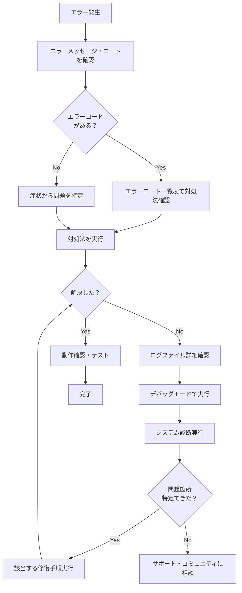

# Whisper Voice MVP - エラー対応表・トラブルシューティングガイド

## 目次

1. [エラーコード一覧表](#エラーコード一覧表)
2. [よくある問題と解決方法](#よくある問題と解決方法)
3. [システム診断手順](#システム診断手順)
4. [デバッグ手順](#デバッグ手順)
5. [初心者エンジニア向け対応フロー](#初心者エンジニア向け対応フロー)
6. [ログファイルの見方](#ログファイルの見方)
7. [緊急時の対応](#緊急時の対応)

---

## エラーコード一覧表

### システム系エラー (1000-1999)

| エラーコード | エラー名 | 原因 | 対処法 | 自動修復 |
|-------------|----------|------|--------|---------|
| **1001** | SYSTEM_STARTUP_ERROR | アプリケーションの起動に失敗 | 1. 管理者権限で実行<br>2. 依存関係を確認<br>3. ログを確認 | ❌ |
| **1002** | SYSTEM_SHUTDOWN_ERROR | アプリケーションの終了処理でエラー | 1. タスクマネージャーでプロセス強制終了<br>2. 再起動後に再実行 | ❌ |
| **1003** | SYSTEM_MEMORY_ERROR | メモリ不足 | 1. 他のアプリケーションを終了<br>2. PCを再起動<br>3. 軽量モデルを使用 | ❌ |
| **1004** | SYSTEM_PERMISSION_ERROR | アクセス権限不足 | 1. 管理者権限で実行<br>2. ファイル・フォルダの権限を確認 | ❌ |

### 音声系エラー (2000-2999)

| エラーコード | エラー名 | 原因 | 対処法 | 自動修復 |
|-------------|----------|------|--------|---------|
| **2001** | AUDIO_DEVICE_NOT_FOUND | 音声デバイスが見つからない | 1. マイクを接続<br>2. デバイスマネージャーでドライバ確認<br>3. Windowsオーディオサービス再起動 | ⚡ 部分的 |
| **2002** | AUDIO_DEVICE_BUSY | 音声デバイスが他のアプリで使用中 | 1. 他のアプリケーションを終了<br>2. 排他モードを無効化<br>3. PCを再起動 | ❌ |
| **2003** | AUDIO_PERMISSION_DENIED | マイクアクセスが拒否された | 1. Windowsプライバシー設定でマイク許可<br>2. アプリの権限設定を確認 | ❌ |
| **2004** | AUDIO_RECORDING_ERROR | 録音処理中のエラー | 1. マイクの接続を確認<br>2. 音声品質設定を下げる<br>3. ドライバーを更新 | ❌ |
| **2005** | AUDIO_FORMAT_ERROR | 音声フォーマットエラー | 1. サンプリングレートを変更<br>2. 別のマイクを使用<br>3. オーディオドライバーを更新 | ❌ |

### Whisper/AI系エラー (3000-3999)

| エラーコード | エラー名 | 原因 | 対処法 | 自動修復 |
|-------------|----------|------|--------|---------|
| **3001** | WHISPER_MODEL_LOAD_ERROR | Whisperモデルのロードに失敗 | 1. インターネット接続を確認<br>2. モデルファイルを削除して再ダウンロード<br>3. 軽量モデル(small)に変更 | ❌ |
| **3002** | WHISPER_MODEL_NOT_FOUND | Whisperモデルファイルが見つからない | 1. インターネット接続を確認<br>2. 初回ダウンロードを待つ<br>3. 手動でモデルをダウンロード | ❌ |
| **3003** | WHISPER_TRANSCRIPTION_ERROR | 文字起こし処理でエラー | 1. 音声の品質を確認<br>2. ノイズを減らす<br>3. 録音時間を短くする | ❌ |
| **3004** | WHISPER_OUT_OF_MEMORY | Whisper処理でメモリ不足 | 1. 他のアプリを終了<br>2. より小さなモデルを使用<br>3. RAMを増設 | ❌ |

### UI系エラー (4000-4999)

| エラーコード | エラー名 | 原因 | 対処法 | 自動修復 |
|-------------|----------|------|--------|---------|
| **4001** | UI_INITIALIZATION_ERROR | UI初期化エラー | 1. PySide6パッケージを再インストール<br>2. 画面解像度を確認<br>3. グラフィックドライバを更新 | ⚡ 部分的 |
| **4002** | UI_DISPLAY_ERROR | 画面表示エラー | 1. 別のモニターで試す<br>2. 画面スケール設定を確認<br>3. セーフモードで起動 | ❌ |
| **4003** | UI_INTERACTION_ERROR | UI操作エラー | 1. マウス・キーボードを確認<br>2. アプリケーションを再起動<br>3. 別の操作方法を試す | ❌ |

### ユーティリティ系エラー (5000-5999)

| エラーコード | エラー名 | 原因 | 対処法 | 自動修復 |
|-------------|----------|------|--------|---------|
| **5001** | CLIPBOARD_ERROR | クリップボード操作エラー | 1. 他のクリップボードアプリを終了<br>2. Windowsを再起動<br>3. クリップボード履歴を無効化 | ❌ |
| **5002** | HOTKEY_REGISTRATION_ERROR | ホットキー登録エラー | 1. 他のアプリのホットキーと競合確認<br>2. 管理者権限で実行<br>3. 別のホットキーを設定 | ❌ |
| **5003** | FILE_IO_ERROR | ファイル入出力エラー | 1. ディスク容量を確認<br>2. ファイル権限を確認<br>3. ウイルススキャンを実行 | ⚡ 部分的 |

### ネットワーク系エラー (6000-6999)

| エラーコード | エラー名 | 原因 | 対処法 | 自動修復 |
|-------------|----------|------|--------|---------|
| **6001** | NETWORK_CONNECTION_ERROR | ネットワーク接続エラー | 1. インターネット接続を確認<br>2. ファイアウォール設定を確認<br>3. プロキシ設定を確認 | ❌ |
| **6002** | NETWORK_TIMEOUT_ERROR | ネットワークタイムアウト | 1. 接続を待つ<br>2. 別の時間帯に試す<br>3. オフラインで使用 | ❌ |

---

## よくある問題と解決方法

### 🎤 音声関連の問題

#### Q1: マイクアイコンが表示されない
**症状**: アプリを起動してもマイクアイコンが画面に表示されない

**原因**: 
- 音声デバイスが接続されていない
- ドライバーの問題
- アプリケーションの初期化エラー

**解決手順**:
1. **マイクの物理接続を確認**
   ```
   マイクがPCに正しく接続されているか確認
   USBマイクの場合は別のUSBポートを試す
   ```

2. **Windowsの音声設定確認**
   ```
   設定 > システム > サウンド > 入力デバイスを確認
   「デバイスのテスト」でマイクが認識されているか確認
   ```

3. **デバイスマネージャー確認**
   ```
   デバイスマネージャー > オーディオの入力および出力
   マイクデバイスにエラーマーク（！や×）がないか確認
   ```

4. **アプリを管理者権限で実行**
   ```
   アプリを右クリック > 管理者として実行
   ```

#### Q2: 録音はできるが文字起こしされない
**症状**: マイクアイコンが赤くなり録音しているが、文字起こし結果が出力されない

**原因**:
- Whisperモデルのロードエラー
- 音声が小さすぎる、ノイズが多い
- メモリ不足

**解決手順**:
1. **音声レベルの確認**
   ```
   マイクに向かってはっきりと話す
   周囲のノイズを減らす
   マイクとの距離を20-30cmに調整
   ```

2. **Whisperモデルの確認**
   ```
   初回起動時はモデルダウンロードに時間がかかる（数分～数十分）
   インターネット接続を確認
   十分に待ってから再試行
   ```

3. **メモリ使用量の確認**
   ```
   タスクマネージャーでメモリ使用率を確認
   他の重いアプリケーションを終了
   ```

#### Q3: ホットキー（Ctrl+Shift+S）が効かない
**症状**: ホットキーを押しても録音が開始されない

**原因**:
- 他のアプリケーションとの競合
- 管理者権限の不足
- キーボードドライバーの問題

**解決手順**:
1. **管理者権限で実行**
   ```
   アプリを右クリック > 管理者として実行
   ```

2. **競合アプリケーションの確認**
   ```
   他のアプリが同じホットキーを使用していないか確認
   一時的に他のアプリケーションを終了して試す
   ```

3. **直接クリック操作で確認**
   ```
   マイクアイコンを直接クリックして動作確認
   ホットキー以外の機能が正常か確認
   ```

### 💻 システム関連の問題

#### Q4: アプリケーションが起動しない
**症状**: アプリをダブルクリックしても何も起動しない

**原因**:
- 必要なパッケージ（依存関係）がインストールされていない
- Python実行環境の問題
- セキュリティソフトによるブロック

**解決手順**:
1. **依存関係の確認（開発環境の場合）**
   ```bash
   # Poetry環境の場合
   poetry install
   poetry shell
   
   # 手動確認
   python -c "import PySide6; import faster_whisper; import sounddevice; print('OK')"
   ```

2. **セキュリティソフトの確認**
   ```
   ウイルス対策ソフトの検疫・隔離フォルダを確認
   一時的にリアルタイム保護を無効化して試す
   アプリケーションを除外リストに追加
   ```

3. **管理者権限での実行**
   ```
   アプリを右クリック > 管理者として実行
   ```

#### Q5: アプリが途中で落ちる（クラッシュする）
**症状**: 使用中に突然アプリケーションが終了する

**原因**:
- メモリ不足
- Whisper処理でのエラー
- 音声デバイスの問題

**解決手順**:
1. **ログファイルの確認**
   ```
   logsフォルダ内の最新ログファイルを確認
   エラーメッセージを探す
   ```

2. **メモリ使用量の監視**
   ```
   タスクマネージャーでメモリ使用率を確認
   他のアプリケーションを終了してメモリを確保
   ```

3. **デバッグモードで実行**
   ```bash
   # 開発環境の場合
   python run_dev.py run
   ```

### 📊 パフォーマンス関連の問題

#### Q6: 文字起こしが遅い
**症状**: 録音停止から結果表示まで30秒以上かかる

**原因**:
- CPUパワー不足
- 重いWhisperモデルの使用
- 他のアプリケーションによるリソース競合

**解決手順**:
1. **他のアプリケーションを終了**
   ```
   不要なアプリケーション、特に動画再生ソフトやゲームを終了
   ブラウザのタブを減らす
   ```

2. **軽量モデルの使用（開発者向け）**
   ```python
   # transcriber.py で medium または small モデルに変更
   TranscriptionEngine(model_size="medium", device="cpu")
   ```

3. **録音時間の短縮**
   ```
   一度に長時間録音せず、短い文章に分けて録音
   ```

#### Q7: CPUやメモリ使用率が異常に高い
**症状**: アプリ実行中にPCが重くなる、ファンが回り続ける

**原因**:
- Whisper Large-v3モデルの高負荷処理
- メモリリークの可能性
- 無限ループやバグ

**解決手順**:
1. **タスクマネージャーで確認**
   ```
   Ctrl+Shift+Esc でタスクマネージャーを開く
   CPU、メモリ、ディスク使用率を確認
   ```

2. **アプリケーションの再起動**
   ```
   アプリを一度終了し、数分待ってから再起動
   ```

3. **PC再起動**
   ```
   PCを再起動してシステムリソースをリセット
   ```

---

## システム診断手順

### 自動診断の実行

1. **デバッグウィンドウを開く**
   ```
   アプリケーション起動時に --debug オプション付きで実行
   または、開発環境でpython run_dev.py run
   ```

2. **システム診断タブを選択**
   ```
   デバッグウィンドウ > システム診断タブ
   「今すぐ診断実行」ボタンをクリック
   ```

3. **診断結果の確認**
   ```
   各項目の状態を確認：
   - OK: 正常
   - WARNING: 注意が必要
   - ERROR: 修復が必要
   ```

### 手動診断チェックリスト

#### システム環境チェック
- [ ] OS: Windows 10/11 (64bit)
- [ ] RAM: 4GB以上（推奨: 8GB以上）
- [ ] 空きディスク容量: 10GB以上
- [ ] CPU: 使用率70%未満

#### 音声環境チェック
- [ ] マイクデバイスの接続
- [ ] Windowsのマイク権限設定
- [ ] 他のアプリでマイクが使用可能
- [ ] オーディオドライバーが最新

#### ソフトウェア環境チェック
- [ ] 必要なPythonパッケージのインストール
- [ ] インターネット接続（初回モデルダウンロード用）
- [ ] セキュリティソフトの除外設定

---

## デバッグ手順

### 1. ログファイルの確認

**ログファイルの場所**:
```
プロジェクトフォルダ/logs/
├── whisper_voice_YYYYMMDD.log     # 一般ログ
└── debug_YYYYMMDD_HHMMSS.json     # デバッグ情報（JSON形式）
```

**ログファイルの見方**:
```
[HH:MM:SS] LEVEL    | COMPONENT            [ERROR_CODE] | MESSAGE
[14:30:15] ERROR    | AudioProcessor       [2001]       | 音声デバイスが見つかりません
```

### 2. デバッグモードでの実行

**開発環境での実行**:
```bash
# デバッグログ有効で実行
python run_dev.py run

# または直接実行
python src/main.py --debug
```

**デバッグ情報の確認**:
- リアルタイムログビューアーでログを監視
- エラー統計でエラーの発生頻度を確認
- システム診断で問題箇所を特定

### 3. ステップバイステップデバッグ

#### Phase 1: 起動確認
1. アプリケーションが正常に起動するか
2. マイクアイコンが表示されるか
3. エラーメッセージが表示されていないか

#### Phase 2: 音声機能確認
1. マイクアイコンをクリックして赤色に変わるか
2. ホットキー (Ctrl+Shift+S) が反応するか
3. 録音中にマイクレベルが反応しているか

#### Phase 3: 文字起こし機能確認
1. 録音停止後にアイコンがオレンジ色（処理中）に変わるか
2. 処理完了後に結果ダイアログが表示されるか
3. クリップボードにテキストがコピーされているか

---

## 初心者エンジニア向け対応フロー

### 🚨 エラー発生時の基本対応フロー



### 📝 問題報告テンプレート

エラーが解決できない場合は、以下の情報を整理してサポートに相談してください：

```markdown
## 環境情報
- OS: Windows 10/11 (バージョン: )
- アプリバージョン: 1.0.0
- 実行方法: [ ] .exe実行 [ ] 開発環境

## 発生した問題
### 症状
（どのような問題が発生したか具体的に記述）

### エラーメッセージ・エラーコード
（表示されたエラーメッセージやエラーコードを記載）

### 再現手順
1. 
2. 
3. 

### 試した対処法
（既に試した対処法があれば記載）

## ログファイル
（logs/ フォルダ内の関連ログファイルの内容を添付）

## システム診断結果
（可能であれば自動診断の結果を添付）
```

### 🎯 レベル別対応指針

#### 🔰 初心者レベル
**対象**: プログラミング経験が浅い、コマンドライン操作に不慣れ

**推奨対応**:
1. まずエラーコード一覧表で対処法を確認
2. GUIからの操作を優先
3. .exeファイル版を使用
4. 不明な点はそのまま実行せず、サポートに相談

#### 🛠️ 中級者レベル
**対象**: 基本的なプログラミング経験がある、コマンドライン操作可能

**推奨対応**:
1. ログファイルを確認してエラー詳細を把握
2. デバッグモードでの実行と問題の切り分け
3. 開発環境での動作確認
4. 簡単な設定変更やパッケージ再インストール

#### ⚡ 上級者レベル
**対象**: 豊富な開発経験がある、ソースコード読解可能

**推奨対応**:
1. ソースコードレベルでの問題特定
2. 自動修復機能の活用
3. 独自の修正・改良
4. コミュニティへの問題報告・修正提案

---

## ログファイルの見方

### ログレベルの意味

| レベル | 色 | 意味 | 対応の必要性 |
|--------|----|----|------------|
| **TRACE** | グレー | 詳細な処理追跡情報 | 不要（開発用） |
| **DEBUG** | 青 | デバッグ情報 | 通常は不要 |
| **INFO** | 緑 | 一般的な動作情報 | 不要（正常動作） |
| **WARNING** | 黄色 | 注意が必要な状況 | 確認推奨 |
| **ERROR** | 赤 | エラーが発生 | **対応必要** |
| **CRITICAL** | 紫 | 重大なエラー | **緊急対応必要** |

### 重要なログメッセージの例

#### 正常な動作例
```
[14:30:15] INFO     | AudioProcessor       | 音声デバイスの初期化が完了
[14:30:16] INFO     | TranscriptionEngine  | Whisperモデルのロードが完了しました
[14:30:20] INFO     | AudioProcessor       | 録音を開始しました
[14:30:25] INFO     | TranscriptionEngine  | 文字起こし完了: こんにちは、テストです
```

#### 問題のあるログ例
```
[14:30:15] ERROR    | AudioProcessor       [2001] | デフォルト音声デバイスの取得に失敗
[14:30:16] ERROR    | TranscriptionEngine  [3001] | Whisperモデルのロードに失敗しました
[14:30:20] WARNING  | HotkeyManager        [5002] | ホットキーの登録に失敗しました
```

### ログ分析のポイント

1. **時系列で問題を追跡**
   - エラーが発生したタイミングを特定
   - どの操作の後にエラーが発生したかを確認

2. **エラーコードから原因を特定**
   - エラーコード一覧表と照合
   - 関連する対処法を確認

3. **繰り返しパターンの確認**
   - 同じエラーが繰り返し発生していないか
   - 特定の操作で必ずエラーが発生しないか

---

## 緊急時の対応

### 🆘 アプリケーションが完全に動作しない場合

#### 即座に試すべき対処法（所要時間: 5-10分）

1. **PC再起動**
   ```
   すべてのアプリケーションを終了してPCを再起動
   ```

2. **管理者権限での実行**
   ```
   アプリを右クリック > 管理者として実行
   ```

3. **セキュリティソフトの一時無効化**
   ```
   ウイルス対策ソフトのリアルタイム保護を一時的に無効化
   （必ず後で再有効化すること）
   ```

#### 中期的な対処法（所要時間: 30分-1時間）

1. **依存関係の再インストール（開発環境の場合）**
   ```bash
   poetry install --force
   ```

2. **ログディレクトリのクリア**
   ```
   logsフォルダ内の古いログファイルを削除
   ```

3. **Whisperモデルの再ダウンロード**
   ```
   ユーザーフォルダ/.cache/huggingface/ を削除
   （再起動時に自動再ダウンロード）
   ```

### 🔧 システム復旧手順

#### 完全な環境再構築（開発環境）

```bash
# 1. 依存関係のクリア
poetry env remove python

# 2. 新しい仮想環境作成
poetry install

# 3. 動作確認
poetry run python run_dev.py test
```

#### 設定初期化

```bash
# 設定ファイルやキャッシュを削除
rm -rf logs/
rm -rf ~/.cache/whisper-voice/
rm -rf ~/.cache/huggingface/
```

### 📞 サポート連絡時の準備

緊急時にサポートに連絡する場合は、以下の情報を準備してください：

1. **基本情報**
   - エラーコード（表示されている場合）
   - 症状の詳細説明
   - 発生タイミング

2. **ログファイル**
   - logs/フォルダ内の最新ログファイル
   - エラー発生時刻前後のログ

3. **システム情報**
   - Windows バージョン
   - 使用しているマイクの種類
   - その他の音声関連ソフトウェア

4. **再現手順**
   - 問題が発生する具体的な操作手順
   - 毎回発生するか、たまに発生するか

---

**📌 重要な注意事項**

- **バックアップ**: 重要なデータは事前にバックアップを取ってください
- **段階的対応**: 簡単な対処法から順番に試してください  
- **ログ保存**: トラブルシューティング前にログファイルをバックアップしてください
- **安全性**: 不明なコマンドは実行前に確認してください

このガイドは継続的に更新されます。新しい問題や解決方法が見つかった場合は、ドキュメントを更新してください。