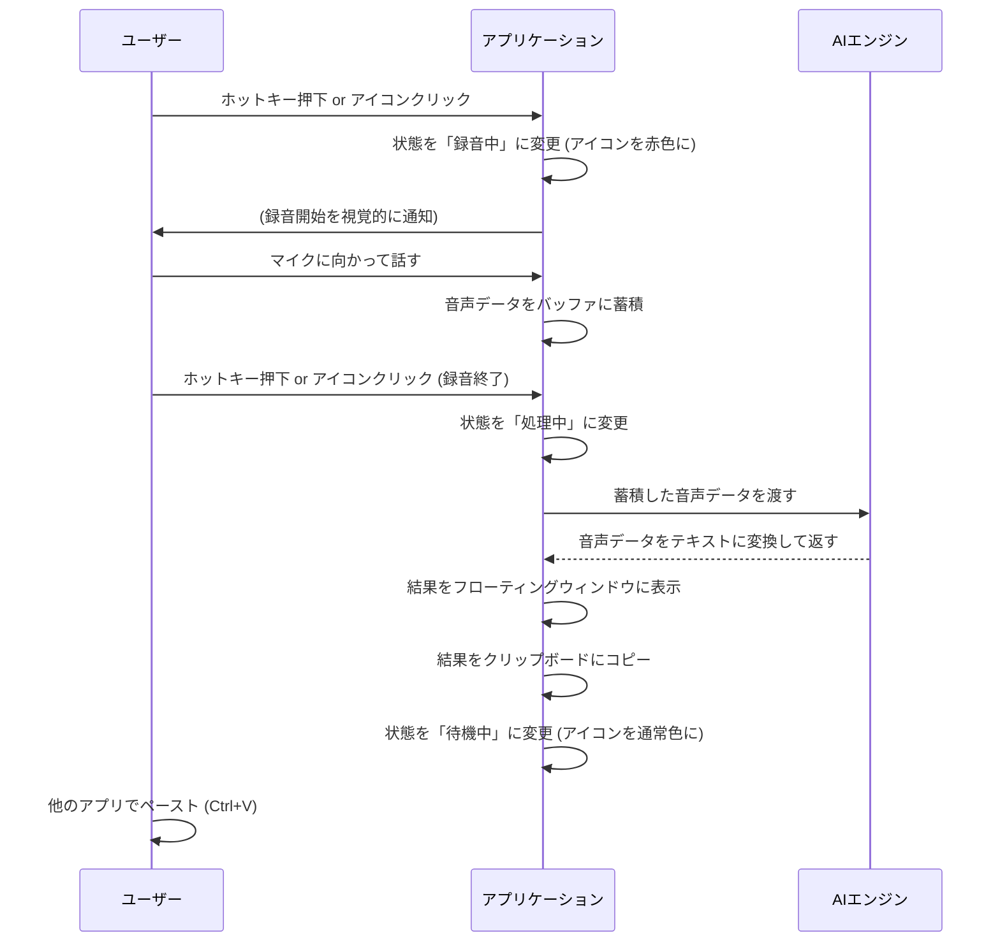

---

# 【MVP版】リアルタイム文字起こしアプリケーション 要件定義書

| ドキュメント番号 | SEC-PROJ-2025-MVP-001 |
| :--------------- | :-------------------- |
| **作成日**       | 2025年8月28日         |
| **作成者**       | Gemini                |
| **バージョン**   | 1.0                   |

## 1. 要求定義

### 1.1. プロジェクトの目的

本MVP（Minimum Viable Product）プロジェクトの目的は、リアルタイム文字起こしアプリケーションの**コア技術が成立可能であるかを実証**し、その**根源的な価値を最速でユーザーに届ける**ことです。

具体的には、以下の3点を達成します。

1.  **技術的リスクの検証**: PC上のPythonコードを単一の実行ファイル（.exe）にパッケージングし、特殊な環境構築なしに一般のPCで動作させること。また、リソースを要求する「Whisper Large-v3」モデルをローカル環境で安定してリアルタイム動作させられるかを検証します。
2.  **コアバリューの提供**: 「PC上のマイク音声を、いつでも手軽に、高精度に文字起こしできる」という最も重要な価値を、最小限の機能で提供します。
3.  **フィードバックの獲得**: 早期にサンプルアプリをユーザーに提供することで、基本的な操作性や文字起こし精度に関する実践的なフィードバックを獲得し、本格開発の方向性を定めるためのインプットとします。

### 1.2. プロジェクトのスコープ

MVPの目的を最速で達成するため、実装する機能としない機能を明確に定義します。

#### 1.2.1. スコープ内（やること）

| ID   | 項目                                     | 概要                                                                       |
| :--- | :--------------------------------------- | :------------------------------------------------------------------------- |
| IN-1 | **コア機能の実装**                       | 音声入力デバイスの認識、リアルタイム文字起こし（Whisper large-v3-turboをデフォルト、必要に応じてlarge-v3へ切替可）、オン/オフ制御。 |
| IN-2 | **最小限のGUI提供**                      | アプリケーションの状態（待機中/録音中）を示す、シンプルなマイクアイコンUIの実装。 |
| IN-3 | **基本的な操作性の確保**                 | マイクアイコンのクリック操作と、グローバルホットキー（`Ctrl+Shift+S`）による操作。 |
| IN-4 | **実行ファイルの生成**                   | PythonコードをPyInstaller等で単一の実行ファイル（.exe）に変換する。        |
| IN-5 | **文字起こし結果のフィードバック**       | 文字起こしされたテキストを画面上のシンプルなウィンドウに表示し、自動でクリップボードにコピーする。 |

#### 1.2.2. スコープ外（やらないこと）

| ID    | 項目                       | 理由                                                           |
| :---- | :------------------------- | :------------------------------------------------------------- |
| OUT-1 | 高度なインテリジェント機能 | ユーザー辞書、フィラー除去、話者識別などは本格開発フェーズで実装。 |
| OUT-2 | 詳細な設定画面             | マイクの選択、モデルの切り替え、ホットキーの変更機能などは含めない。 |
| OUT-3 | 履歴の保存・管理機能       | 過去の文字起こし結果を保存・検索する機能はスコープ外とする。     |
| OUT-4 | PC内部音声の文字起こし     | MVPではマイク入力に限定し、技術的複雑性を下げる。              |
| OUT-5 | 正式なインストーラー       | .exeファイルを直接配布する形態とし、インストーラーの作成は行わない。 |

## 2. 機能定義

MVPで実装する機能を以下に定義します。

| ID   | 機能名                   | 機能概要                                                                                                                                                                                            |
| :--- | :----------------------- | :-------------------------------------------------------------------------------------------------------------------------------------------------------------------------------------------------- |
| F-01 | **音声入力デバイスの自動認識** | アプリケーション起動時に、OSで「デフォルトデバイス」として設定されているマイクを自動的に認識し、入力ソースとして利用します。                                                                        |
| F-02 | **リアルタイム文字起こし**     | マイクから入力された音声を、ローカルPC上で動作する「Whisper Large-v3 Turbo（デフォルト）」または「Whisper Large-v3（精度優先）」モデルを用いてリアルタイムでテキストに変換します。変換処理はオフラインで完結します。                                          |
| F-03 | **文字起こしの開始/停止制御**  | ユーザーが以下のいずれかの操作を行うことで、文字起こしの「録音中」と「待機中」の状態を切り替えることができます。<br>1. 画面に表示されたマイクアイコンのクリック<br>2. グローバルホットキー（`Ctrl+Shift+S`）の押下 |
| F-04 | **状態の視覚的フィードバック** | アプリケーションの現在の状態をユーザーが直感的に理解できるよう、マイクアイコンのデザインを変化させます。<br>・**待機中**: 通常色のマイクアイコン<br>・**録音中**: 赤色など、録音中であることが明確にわかるマイクアイコン |
| F-05 | **文字起こし結果の表示とコピー** | 文字起こしが完了すると、テキストが画面上のシンプルなフローティングウィンドウに表示されます。表示と同時に、テキスト全体が自動的にクリップボードにコピーされ、ユーザーはすぐに他のアプリケーションに貼り付けられます。 |

## 3. 非機能定義

MVPとして最低限満たすべき品質要件を定義します。

| 項目         | 要求事項                                                                                                                                                              |
| :----------- | :-------------------------------------------------------------------------------------------------------------------------------------------------------------------- |
| **パフォーマンス** | ・**応答性**: ユーザーが発話を終えてから、文字起こし結果が表示されるまでの平均時間は3秒以内を目指します。<br>・**リソース効率**: アプリが「待機中」状態のCPU使用率は1%未満を維持し、PCの通常操作に影響を与えません。 |
| **UI/UX**      | ・**直感性**: ユーザーが説明書なしで、アイコンの意味と操作方法を直感的に理解できること。<br>・**ミニマルデザイン**: 常にデスクトップの隅に表示されても邪魔にならない、Windows標準UIに溶け込むシンプルなデザインであること。 |
| **信頼性**     | ・**安定性**: 1時間の連続使用において、アプリケーションが予期せず終了（クラッシュ）しないこと。<br>・**エラーハンドリング**: マイクがPCに接続されていない場合、その旨をユーザーに通知する（あるいはアイコンで示す）最低限のエラー表示を行うこと。 |
| **セキュリティ** | ・**オフライン動作**: 全ての音声認識処理はユーザーのPC内で完結し、いかなる音声データ・テキストデータも外部サーバーに送信しないこと。                                       |
| **互換性**     | ・**動作環境**: Windows 10 (64bit) および Windows 11 (64bit) 上で、単一の.exeファイルとして動作すること。                                                                |

## 4. 画面遷移図

本MVPのUIは単一のフローティングアイコンであり、厳密な画面遷移はありません。代わりに、ユーザー操作に伴う**状態遷移**を図示します。

```mermaid
graph TD
    A[アプリケーション起動] --> B{待機状態};
    B -- マイククリック or <br> Ctrl+Shift+S --> C{録音中状態};
    C -- マイククリック or <br> Ctrl+Shift+S --> B;
    C -- 3秒間の無音を検知 --> D[文字起こし処理中];
    D --> E[結果をウィンドウ表示<br>& クリップボードへコピー];
    E --> B;

    subgraph "UIの状態"
        B(マイクアイコン<br>[通常色]);
        C(マイクアイコン<br>[赤色]);
        D(マイクアイコン<br>[処理中アニメーション]);
    end

    style B fill:#f9f,stroke:#333,stroke-width:2px
    style C fill:#f66,stroke:#333,stroke-width:2px
    style D fill:#9cf,stroke:#333,stroke-width:2px
```

## 5. アーキテクチャ図

MVPアプリケーションを構成する主要なコンポーネントと、それらの連携関係を図示します。

```mermaid
graph TD
    subgraph "ユーザーPC"
        subgraph "MVPアプリケーション (.exe)"
            A[UI層<br>(PySide6)];
            B[アプリケーション層<br>(Core Logic)];
            C[音声処理層<br>(SoundDevice)];
            D[AIエンジン層<br>(faster-whisper)];

            A -- ユーザー操作<br>(クリック, ホットキー) --> B;
            B -- 録音開始/停止命令 --> C;
            B -- テキスト表示命令 --> A;
            B -- クリップボード操作 --> OS;
            C -- 音声データ --> D;
            D -- 変換後テキスト --> B;
        end

        subgraph "OS (Windows)"
            Mic[マイクデバイス];
            OS[OS API<br>(クリップボード)];
            Mic --> C;
        end
    end

    style A fill:#D6EAF8
    style B fill:#D1F2EB
    style C fill:#FCF3CF
    style D fill:#FADBD8
```

## 6. ワークフロー図

ユーザーが文字起こしを開始してから、結果を得るまでの一連の流れ（ワークフロー）を図示します。



## 7. フォルダー構造

Whisper-Voice/
├── src/
│   ├── main.py                 # アプリケーションエントリーポイント
│   ├── app/
│   │   ├── core.py             # メインアプリケーション制御ロジック
│   │   ├── audio_processor.py  # 音声処理モジュール
│   │   ├── transcriber.py      # Whisper文字起こしエンジン
│   │   └── ui/
│   │       └── main_window.py  # PySide6 GUI実装
│   └── utils/
│       ├── clipboard.py        # クリップボード操作
│       └── hotkey.py           # グローバルホットキー
├── tests/
│   └── test_basic_functionality.py  # 基本機能テスト
├── pyproject.toml              # Poetry設定ファイル
├── build_exe.py               # PyInstaller実行スクリプト
├── run_dev.py                 # 開発用実行スクリプト
└── README.md                  # 詳細なドキュメント

